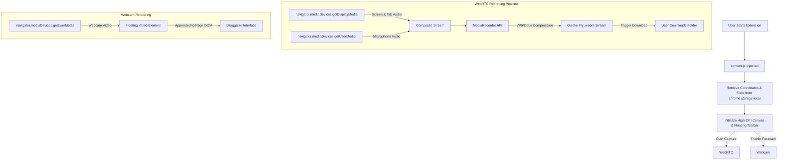

# 🎥 ScreenNote — Record, Annotate & Present (Zero-Install Explainer Tool)

<div align="center">
  
  [](https://opensource.org/licenses/MIT)
  [](#)
  [](#)
  [](#)
  
  **An advanced, ultra-lightweight, browser-native extension that combines pro-grade screen annotations, high-definition display recording, and picture-in-picture webcam streaming into a single, cohesive canvas.**
  
</div>

---

## 💡 The Real-Life Problem ScreenNote Solves

In today’s remote-first world, explaining digital concepts, teaching students, or reporting software bugs is a constant challenge. However, users are forced to choose between highly fragmented or bloated solutions:

### 1. The "Feature Gap" Paywall (Annotation vs. Recording)
* **The Problem:** Most free tools only do *one thing*. You can find simple browser drawing tools, or you can find simple screen recorders. Finding a tool that seamlessly overlays **drawing tools + screen recording + microphone + draggable facecam (webcam)** usually requires a premium, paid subscription to commercial software (charging anywhere from $10 to $30 a month per user).
* **The ScreenNote Solution:** ScreenNote brings these features together into a single, unified, open-source dashboard. Draw while you record, stream your face in a floating bubble, and mute/unmute your microphone on the fly—completely for free.

### 2. The "C-Drive" & Resource Bloat Crisis
* **The Problem:** Desktop-grade recording apps (like OBS, Camtasia, or native OS capture suites) are heavy. They require gigabytes of disk space for installation, force background services to run, and cache huge, uncompressed raw footage files directly to your C-Drive. Over time, this leads to massive system slowdowns and a dreaded **"Disk Space Full"** warning. 
* **The ScreenNote Solution:** Built entirely on modern browser-native APIs (WebRTC & Canvas), ScreenNote runs completely sandboxed in your browser. It requires **zero software installation** and **zero background cache**. Videos are encoded dynamically on-the-fly and saved as highly-efficient, lightweight `.webm` files directly through your browser’s standard download stream, bypassing system drive clutter.

### 3. The Educator's Digital Blackboard
* **The Problem:** Modern virtual learning is often detached and static. PowerPoint presentations lack the dynamic feel of a physical chalkboard, and teachers struggle to draw focus to specific bullets while maintaining visual contact (face recording) with their students.
* **The ScreenNote Solution:** ScreenNote acts as an interactive digital chalkboard. Teachers can underline key paragraphs, draw arrows to diagrams, highlight formulas, and elaborate on concepts in real-time, all while their circular webcam bubble floats alongside to keep students engaged and connected.

### 4. The Self-Study & Active Recall Accelerator
* **The Problem:** Reading static textbook PDFs, academic research, or online documentation can lead to passive, ineffective learning.
* **The ScreenNote Solution:** Students can load up study materials, toggle ScreenNote, draw mind-maps directly over the page, type inline footnotes, and record their screen while explaining the concept aloud. This active recall and elaboration method dramatically increases information retention, creating personal video study guides instantly.

---

## 🌟 Key Features

* ✏️ **Pro-Grade Annotation Engine:** Select from a Pen, Flat Highlighter, Arrow, Rectangle, Circle, and Inline Text tool to write on any live webpage.
* 🎥 **Webcam Picture-in-Picture (Facecam):** Record with a floating, circular facecam bubble. Move it anywhere on the screen by dragging and dropping so it never blocks key content.
* 🎙️ **Dual-Stream Audio Capture & Real-Time Mute:** Capture system/tab audio alongside your microphone. Toggle your microphone state (mute/unmute) in real-time during recording with a single shortcut or click.
* 🔄 **Persistent Tab-Synchronized Toolbar:** The vertical toolbar follows you. Switch tabs, refresh pages, or navigate around the web; the toolbar remembers its exact pixel-coordinates and syncs active drawing modes instantly across all tabs.
* 🎨 **Premium Glassmorphic UI:** A sleek, semi-transparent user interface styled with vibrant HSL colors, smooth transitions, and high-DPI custom icons that feel premium and modern.
* 💾 **Instant Snapshots:** Snap high-resolution PNGs of your drawings and webpage underlays with a single click.
* 🛡️ **Zero-Install & Sandbox Secure:** Standard Manifest V3 Chrome Extension. Safe, lightweight, and automatically uninstalls without leaving orphaned system registries or temp cache folders.

---

## 🚀 Installation Guide (Developer Mode)

Since ScreenNote is fully local and open-source, you can easily load it as an unpacked extension:

1. **Download the Repository:** Clone or download this repository to your local drive.
2. **Open Extensions Page:** Open Google Chrome (or Edge/Brave) and navigate to `chrome://extensions/`.
3. **Enable Developer Mode:** Toggle the **"Developer mode"** switch in the top-right corner.
4. **Load Unpacked:** Click the **"Load unpacked"** button in the top-left corner.
5. **Select Folder:** Select the `screen-annotator-extension` subfolder (the directory containing `manifest.json`).
6. **Pin to Toolbar:** Click the extensions puzzle icon in Chrome and pin **ScreenNote** for quick, one-click access!

---

## 🛠️ Technical Deep-Dive & Architecture

ScreenNote is built using a highly-optimized vanilla JavaScript architecture, maximizing performance without the overhead of modern frame libraries (React/Vue/Webpack).



### Key Implementation Details:

1. **Double-Alpha Highlighter Anti-Aliasing:**
   When using a standard canvas highlighter with opacity (e.g. `globalAlpha = 0.4`), overlapping brush strokes accumulate alpha values, leading to dark, messy artifacts at stroke intersections. ScreenNote solves this by drawing your path onto an **offscreen canvas** at full opacity (`globalAlpha = 1.0`) with flat ends (`lineCap = 'square'`), and then compositing the entire offscreen buffer onto the main page canvas *once* at `0.4` opacity. The result is a perfect, flat, professional highlighter effect.

2. **Ultra-Reactive Cross-Tab Synchronization:**
   Rather than relying on continuous polling or round-trip background service-worker messaging, ScreenNote uses the browser-native `chrome.storage.onChanged` API within content scripts. The instant a toolbar setting or activation state shifts on tab A, all other open tabs immediately react to the local storage changes, updating their UI state and drawing layers synchronously.

3. **Orphaned Context Guard:**
   Chrome extensions frequently suffer from "orphaned contexts" when they are updated or reloaded by a developer, leaving dead event listeners and broken HTML elements lingering on web pages. ScreenNote implements a custom re-injection guard on load:
   ```javascript
   if (window.__screenNoteLoaded) {
     ['screennote-overlay', 'screennote-toolbar', 'screennote-textinput', 'sn-donate-popup']
       .forEach(id => document.getElementById(id)?.remove());
   }
   window.__screenNoteLoaded = true;
   ```
   This ensures clean teardowns and avoids duplicate overlays, making the developer experience seamless.

4. **Dynamic Resizing & High-DPI Support:**
   To keep drawings perfectly aligned with underlying text, the canvas scales dynamically based on the device's hardware pixel density (`window.devicePixelRatio`). When resizing occurs, canvas pixels are backed up, coordinates scaled, and content redrawn instantly to prevent blurriness or layout drifting.

---

## ⌨️ Interactive Controls & Shortcuts

For professional creators and educators, speed is essential. ScreenNote is fully equipped with global hotkeys:

| Key Shortcut | Tool / Action | Description |
| :--- | :--- | :--- |
| <kbd>P</kbd> | **Pen Tool** | Activate the fine-point writing brush. |
| <kbd>H</kbd> | **Highlighter** | Select the flat-marker highlight overlay. |
| <kbd>E</kbd> | **Eraser** | Erase drawing vectors smoothly. |
| <kbd>T</kbd> | **Text Box** | Click anywhere to type high-DPI text overlays. |
| <kbd>A</kbd> | **Arrow tool** | Draw straight arrows pointing to critical layout areas. |
| <kbd>R</kbd> | **Rectangle** | Outline sections with boxes. |
| <kbd>M</kbd> | **Toggle Mic** | Mute or unmute your voice stream in real-time. |
| <kbd>Ctrl</kbd> + <kbd>Z</kbd> | **Undo** | Step back in drawing history. |
| <kbd>Ctrl</kbd> + <kbd>Y</kbd> | **Redo** | Step forward in drawing history. |
| <kbd>S</kbd> | **Save Snapshot** | Download the current canvas drawing as a transparent PNG. |
| <kbd>Esc</kbd> | **Minimize Toolbar**| Instantly hide drawings and collapse toolbar. |

---

## ☕ Support the Project

ScreenNote is built and maintained with a focus on making education and digital collaboration free and accessible to everyone. If ScreenNote has helped you teach a class, study for exams, or report bugs faster, consider supporting development!

You can scan the QR code directly inside the extension toolbar using GPay, PhonePe, Paytm, or any UPI app:

* **UPI ID:** `manvisinhan4500@oksbi`

---

## 📜 License

This project is licensed under the [MIT License](LICENSE) - see the LICENSE file for details.

*Crafted with ❤️ for teachers, learners, and builders everywhere by [@manviisinha](https://github.com/manviisinha).*
